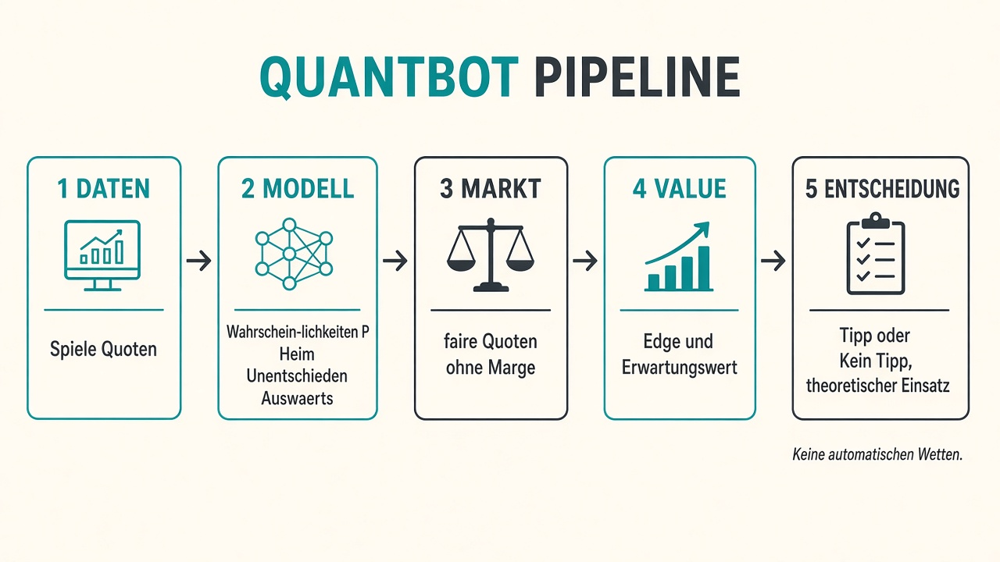
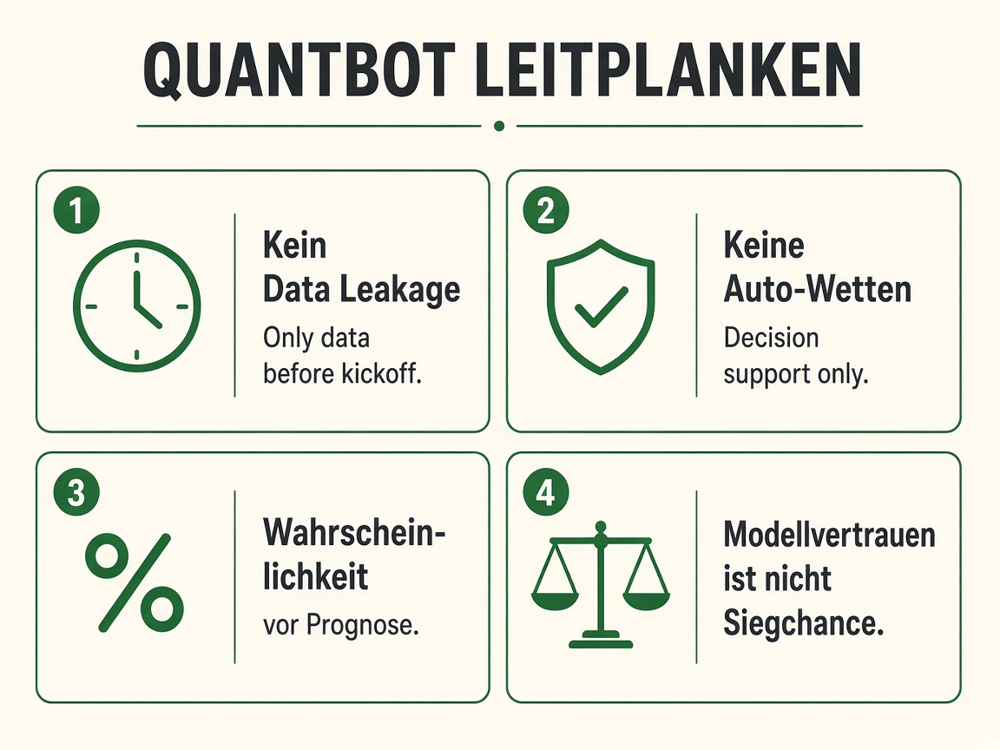
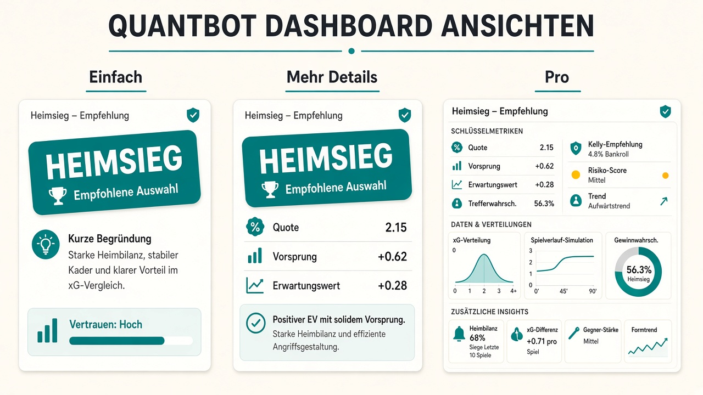

# QuantBot (Oddsforge) — Review-Brief für KI-Assistenten

**Zweck dieses Dokuments:** Bitte Idee, Architektur und Berechnungen kritisch prüfen.  
Gesucht sind: Schwächen, Risiken, bessere Formeln, fehlende Features, UX-Ideen und ethische Hinweise.  
Stand: Version **0.2.9** (März 2026 / Repo Oddsforge).

---

## 1. Kurzpitch

**QuantBot** ist eine **Entscheidungshilfe** für Fußball-Wetten — **kein** Bot, der automatisch wettet.

Es vergleicht:
- Modell-Wahrscheinlichkeiten für Spielausgänge (und optional Über/Unter Tore)
- mit **margen** Buchmacher-Quoten (Marge herausgerechnet)

Nur wenn ein klarer Vorteil (Edge) und genug Datenqualität da sind, entsteht ein Tipp. Sonst: **„Kein Tipp“** — das ist absichtlich oft die richtige Antwort.

Zielgruppe: Menschen ohne Statistik-Hintergrund (Ansicht „Einfach“) bis hin zu Nutzern mit Backtest/Kennzahlen (Ansicht „Pro“).

---

## 2. Leitplanken (nicht verhandelbar)

1. **Kein Data Leakage**  
   Für jede Vorhersage dürfen nur Informationen genutzt werden, die **vor dem Anpfiff** bekannt waren (`as_of` / `prediction_timestamp`). Ergebnisse nach dem Anpfiff fließen nicht in Features ein.

2. **Keine automatischen Wetten**  
   Einsätze sind **theoretisch** (Fractional Kelly). Das System platziert nichts.

3. **Wahrscheinlichkeit vor „Wer gewinnt?“**  
   Ausgabe sind kalibrierte Wahrscheinlichkeiten und Value-Signale — keine Sieger-Garantien.

4. **Modellvertrauen ≠ Siegchance**  
   Ein Score „Modellvertrauen 70“ ist **nicht** „70 % Heimsieg“.

5. **API-Schlüssel bleiben lokal**  
   Nie im Repo, nur auf dem PC des Nutzers.

---

## 3. Architektur (4 Schichten)

```
Daten (Spiele + Quoten)
        ↓
Layer 1  Prediction   →  P(Heim), P(Unentschieden), P(Auswärts)  [+ Score-Matrix]
        ↓
Layer 2  Market       →  faire Markt-Wahrscheinlichkeiten (Marge entfernt, z. B. Shin)
        ↓
Layer 3  Value        →  Edge, Expected Value (EV), Datenqualität, Konfidenz
        ↓
Layer 4  Decision     →  VALUE_* oder NO_BET + theoretischer Kelly-Anteil
```

**Bild: Pipeline**



**Bild: Leitplanken**



**Bild: Ansichten**



---

## 4. Kernformeln (bitte besonders prüfen)

### 4.1 Edge
\[
\text{Edge} = p_{\text{Modell}} - p_{\text{Markt, fair}}
\]

### 4.2 Expected Value (pro 1 € Einsatz)
\[
\text{EV} = p_{\text{Modell}} \cdot \text{Dezimalquote} - 1
\]

### 4.3 Fairer Markt
Roh-Implied = \(1/\text{Quote}\). Summe > 1 wegen Buchmacher-Marge (Overround).  
Marge-Entfernung u. a. mit **Shin** (Default), alternativ Power / multiplikativ.

### 4.4 Kelly (theoretisch)
Voll-Kelly:
\[
f^* = \frac{p\cdot o - 1}{o - 1} = \frac{\text{EV}}{o - 1}
\]
Genutzt wird **Fractional Kelly** (Default \(0{,}25\times\)), hart gedeckelt (Default max. 5 % Bankroll).

### 4.5 No-Bet-Filter (Defaults)
Ein Tipp fällt durch, wenn u. a.:
- Edge < **3 %**
- EV < **0**
- Overround > **12 %**
- Datenqualität < **60**/100
- Modellvertrauen < **55**/100
- Quote außerhalb ca. **1,2 … 15**

### 4.6 Über/Unter (z. B. 2,5 Tore)
Aus der Ergebnis-Matrix \(P(\text{Heim-Tore}=i,\ \text{Auswärts-Tore}=j)\):
- Over = Summe aller Zellen mit \(i+j > \text{Linie}\)
- Under = Summe mit \(i+j < \text{Linie}\)  
(Linie konfigurierbar; Default 2,5). Gleiche Value-/Decision-Regeln wie 1X2.

---

## 5. Modelle & Daten

**Modelle (u. a.):** Elo, Poisson-/Score-Matrix-Modell, logistische Regression, Ensemble, optional Kalibrierung.

**Daten:**
- Demo: deterministische Fake-Saison (ohne API)
- Live: Ergebnis-/Spielplan-API + Quoten-API; abgeschlossene Spiele lokal gecacht; Schlüssel lokal gespeichert

**Ligen (Live):** Premier League, Bundesliga, La Liga, Serie A, Ligue 1, Champions League.

---

## 6. Produkt / UX (Dashboard)

Drei Ansichten:
- **Einfach** — ein Tipp, Begründung, Tippschein, Verlauf, Glossar
- **Mehr Details** — Edge/EV/Einsatz, Spielkarte, Backtest
- **Pro** — Kalibrierung, Modelle, Diagnose, volle Kennzahlen

Weitere Features:
- Tippschein (theoretische Kombi): Anzahl wählbar, Tipps abwählbar, „Beste Chancen“ / Booster
- Verlauf mit Trefferquote (Demo/Live getrennt gespeichert)
- Spieltag-Fenster (Heute / 3 Tage / 7 Tage)
- Willkommen-Onboarding, Sicherheitsbanner

---

## 7. Was bewusst *nicht* gemacht wird

- Kein Auto-Betting / keine Broker-Anbindung
- Keine „sicheren Tipps“-Marketing-Claims
- Kein Vermischen von Demo- und Live-Historie
- Keine Vorhersage mit Live-Spielständen (nur pre-kickoff)

---

## 8. Bitte um Feedback — konkrete Fragen

### Idee & Ethik
1. Ist „Entscheidungshilfe + oft Kein Tipp“ die richtige Positionierung für Laien?
2. Welche Warnhinweise fehlen noch (Sucht, Varianz, Ruin-Risiko)?
3. Soll man Tippschein/Kombis für Einfach noch stärker einschränken?

### Mathematik & Statistik
4. Ist Shin als Default-Marge-Methode sinnvoll, oder eher Power/andere?
5. Edge 3 % / Kelly 0,25 / Cap 5 % — zu aggressiv oder zu konservativ?
6. Unabhängigkeitsannahme bei Kombi-Scheinen: bessere Darstellung oder Korrektur?
7. Score-Matrix → Over/Unter: Blind spots bei Push/Linien oder Low-Score-Abhängigkeit?
8. Kalibrierung & Backtest: welche Metriken sollten Laien vs. Experten sehen?

### Features
9. Was fehlt als Nächstes: Bankroll-Tracker, Closing Line Value live, Verletzungen, xG, Poisson-Simulationen, Multi-Book Line Shopping?
10. Wie verhindert man, dass Nutzer Edge mit „Gewinnchance“ verwechseln?
11. Welche Erklärungen (Tooltips/Glossar) sind Pflicht vor dem ersten Tippschein?

### UX
12. Reihenfolge Tipps → Tippschein → Verlauf sinnvoll?
13. Zu viel Jargon trotz „Einfach“-Modus?
14. Wie visualisiert man Unsicherheit besser (Intervalle statt Punktwahrscheinlichkeiten)?

---

## 9. Gewünschte Antwortform (an die KI)

Bitte antworte strukturiert:

1. **Gesamteindruck** (3–5 Sätze)  
2. **Stärken**  
3. **Schwächen / Risiken** (priorisiert)  
4. **Kritik an den Formeln/Defaults** (konkret, mit Alternativen)  
5. **Feature-Backlog** (Must / Should / Nice)  
6. **UX-Impulse**  
7. **Ethische / regulatorische Hinweise** (DE/EU, soweit relevant)

Sei kritisch. Höflichkeit hilft nicht — ehrliche Einwände schon.

---

## 10. Einzeiler zum Einfügen in den Chat

> Anbei die Beschreibung von QuantBot, einer Fußball-Entscheidungshilfe (keine Auto-Wetten). Bitte Idee, Pipeline, Formeln (Edge, EV, Shin, Kelly, No-Bet-Filter, Over/Under aus Score-Matrix) und UX kritisch prüfen und Verbesserungsvorschläge priorisieren. Bilder der Pipeline/Leitplanken/Ansichten sind angehängt.
